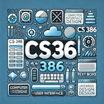
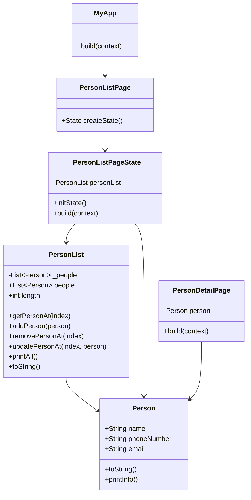

# 📘 CS 386 Final Project Requirements

**Course Project Presentation:**  
🗓️ **Wednesday, April 30th**  
🕥 **10:30 AM** (during the final exam session)

---

## 🔍 Project Overview
Each student will design and build a functional application—**web**, **desktop**, or **mobile**—that integrates the key concepts covered in this course. Your project must demonstrate both **technical competency** and **good software design practices**. 

**AI may be used** to generate code. Use of AI must be included in project documentation. Must be able to describe the purpose and functionality of all code submitted.

---

## ✅ Required Features

### 1. **Language & Platform**
- ✅ You may choose either **Python** or **Dart/Flutter**.


### 2. **Object-Oriented Design**
- ✅ Your project must use an **object-oriented architecture**.
- Follow a **Model-View** structure:
  - `Model` → handles data and business logic.
  - `View` → GUI using Tkinter (Python) or Flutter widgets (Dart).
  - Optional: separate a `Controller` if you prefer MVC.

### 3. **GUI and UX**
- ✅ Your app must include a **graphical user interface**.
- Use good design practices (clear layout, intuitive interactions, consistent styling).

### 4. **Data Input/Output**
  - ✅ Your project must be able to:
  - **Save and open data** if using **Python**.
  - **Read or open data** (from files or a database) if using **Dart/Flutter**. Of course, you can do both 😊
  - Can save/open file (e.g., `.json`, `.txt`, `.csv`)
  - Or a database (e.g., SQLite, Hive, Firebase)
  - Can use SharedPreferences for saving in Dart/Flutter

### 5. **Internal Code Documentation**
- ✅ Your code must contain **comments throughout code**.
- ✅ Add comments at the top of each file indicating the **filename**, **date**, **author**, and **description**.
- ✅ Add comments for **key sections**

### 6. **Source Code Management**
- ✅ Host your project on **GitHub**.
- ✅ Submit your project by **sharing the GitHub link**.
---

### 7. ✅ 📄 Required Documentation

Your GitHub repository must include a well-written **`README.md`** file that serves as a user and developer guide.

It must contain:

1. ✅ **Project Introduction**  (1 or 2 paragraphs)
   - What does your app do?
   - Who is the target user?

2. ✅ **Design and Architecture**
   - Description of how the app is structured.
   - Include **Mermaid class diagrams** for all classes.
     - Example:
       ````markdown
       ```mermaid
       classDiagram
         class Person {
           - String name
           - String email
           + fromJson()
         }
       ```
       ````
       
       ```mermaid
       classDiagram
         class Person {
           - String name
           - String email
           + fromJson()
         }
       ```
    - **Optional** Show the class interactions (see diagram at bottom of page)
      
3. ✅ **Instructions** (2 or 3 paragraphs)
   - How to install and run the app.
   - How to use key features (add screenshots or GIFs if helpful).
   - How do you test it? 

4. ✅ **Challenges, Role of AI, Insights** (2 or 3 paragraphs)
   - What problems did you face and solve?
   - How did you use AI?
   - What did you learn about GUI design, programming, or tools?

5. ✅ **Next Steps** (1 or 2 paragraphs)
   - If you had more time, what would you improve, add, or refactor?
   - Any features you'd like to explore in the future?

---
### Point Breakdown

| **Component**    | **Percent** |
| -------- | ------- |
| Project Functionality and Complexity  | 50% |
| OOP Design | 10% |
| Data Input/Output | 10%|
| Internal Code Documentation  | 10% |
| Required Documentation    | 15% |
| Project Presentation    | 5% |


---
## 📣 Presentation (April 30)
- Prepare a **5 minute live demo**.
- Plan to connect your computer to the HDMI cable in class. Please test before class and ensure you have any needed adapters.
- Walk through your app and briefly explain your code structure.
- Highlight features and data input/output.
- Share two challenges or insights.

---
## (Optional) Class Diagram and Interactions (mermaid)



---

-- end --

---

