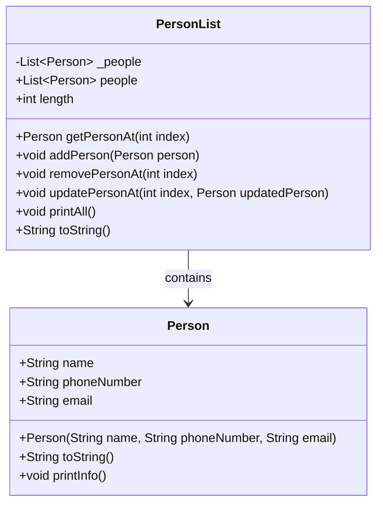

```mermaid

classDiagram

class Person {
  +String name
  +String phoneNumber
  +String email
  +Person(String name, String phoneNumber, String email)
  +String toString()
  +void printInfo()
}

class PersonList {
  -List~Person~ _people
  +List~Person~ people
  +int length
  +Person getPersonAt(int index)
  +void addPerson(Person person)
  +void removePersonAt(int index)
  +void updatePersonAt(int index, Person updatedPerson)
  +void printAll()
  +String toString()
}

PersonList --> Person : contains
```
