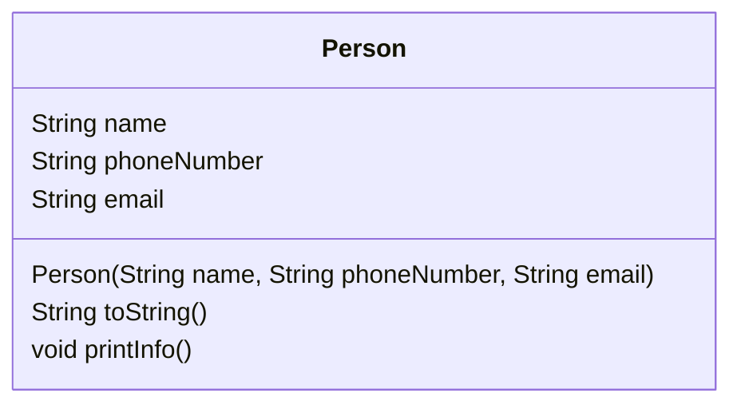

## see Moodle page for .zip of Address Book

1. version 1 "hard codes" data
2. version 2 reads data from file person.json

```mermaid
classDiagram
  class Person {
    String name
    String phoneNumber
    String email
    Person(String name, String phoneNumber, String email)
    String toString()
    void printInfo()
  }
```
